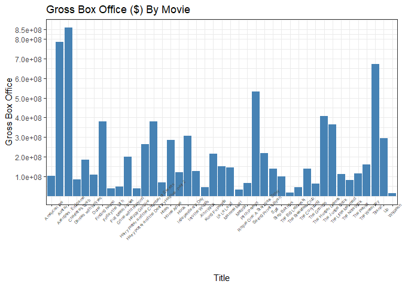

Interacting with API’s - Example with the Open Movie Database API
================
Grace Holliday
2023-06-11

This document is a vignette designed to introduce retrieving and
manipulating data from an API (Application Programming Interface). I
will be interacting with the Open Movie Database API (OMDb). I will
build several functions comprised of a six endpoints and demonstrate
some basic data manipulation.

Endpoints include: Highest Grossing Movie, Highest Average Movie Rating,
Runtime by Genre, Viewing Movie Posters, Oldest Movies, and Movies by
Genre and Rating (PG, PG-13, etc.)

### Requirements

Packages necessary for interactions with the OMDb API/data cleaning and
manipulation from the OMDb API:

1.  **tidyverse**: A collection of R packages for data science,arguably
    most useful for data manipulation and cleaning.

2.  **jsonlite**: A JSON parser and generator, optimized for statistical
    data and the web. Notably useful for interacting with a web API.

3.  **imager**: Useful for loading and plotting images.

4.  **ggplot2**: Useful for creation of various plots and images.

### API Interaction Functions

#### Highest Grossing Movie with *HighGross*

This function takes a vector of several Movie titles and determines
which movie was the highest grossing, along with the year of release. It
produces a data frame ranking the movies from highest to lowest
grossing.

``` r
## Example vector of movies
m <- c("Titanic","Iron Man","Avengers: Endgame","Dances with Wolves")

## This is a supporting function to the user-input function below
Gross <- function(Title){
    Title <- gsub(" ", "+", Title)
    url <- paste("https://www.omdbapi.com/?t=",Title,"&apikey=82725ca8",sep="")
    data <- GET(url)
    # converting raw data to character
    data = rawToChar(data$content)
    # converting character to json format
    jsondata = fromJSON(data)
    # Putting news title gross earnings, and year into R object
    tgy <- c(jsondata$Title,as.numeric(parse_number(jsondata$BoxOffice)),
    jsondata$Year)
    return(tgy)
}

## Function for user-input
HighGross <- function(Movies){
  x <- data.frame(matrix(NA,nrow=length(Movies),ncol=3))
  for(i in 1:length(Movies)){
      
     x[i,] <- Gross(Movies[i])
  }
  x <- x[order(x$X2,na.last=TRUE,decreasing=TRUE),]
  colnames(x)[1] <- 'Title'
  colnames(x)[2] <- 'Gross Box Office ($)'
  colnames(x)[3] <- 'Year'
  return(x)
  }

## Example using function
HighestGrossing <- HighGross(m)
HighestGrossing
```

    ## # A tibble: 4 × 3
    ##   Title              `Gross Box Office ($)` Year 
    ##   <chr>              <chr>                  <chr>
    ## 1 Avengers: Endgame  858373000              2019 
    ## 2 Titanic            674292608              1997 
    ## 3 Iron Man           319034126              2008 
    ## 4 Dances with Wolves 184208848              1990

#### Comparing Metrics of Ratings with *HighestRating*

This function is used to explore the various online movie-rating
systems, and the differences in ranking between each system for a given
movie. This function returns a vector including movie title, Internet
Movie Database rating, Rotten Tomatoes rating, Metacritic rating, and
IMDb rating. These are sorted by highest average score (standardized to
a scale out of 100 for each rating system).

``` r
## Example vector of movies
m <- c("Titanic","Avengers: Endgame","Gone with the Wind", 
       "One Direction: This Is Us")

## This is a supporting function to the user-input function below
Ratings <- function(Title){
    Title <- gsub(" ", "+", Title)
    url <- paste("https://www.omdbapi.com/?t=",Title,"&apikey=82725ca8",sep="")
    data <- GET(url)
    # converting raw data to character
    data = rawToChar(data$content)
    # converting character to json format
    jsondata = fromJSON(data)
    # Putting news title gross earnings, and year into R object
    tgy <- c(jsondata$Title,jsondata$Ratings[1,2],jsondata$Ratings[2,2],
             jsondata$Metascore,jsondata$imdbRating)
    mean <- mean(as.numeric(substr(tgy[2],1,3))*10,
              as.numeric(substr(tgy[3],1,2)), as.numeric(tgy[4]),
              as.numeric(tgy[5])*10)
    tgy <- c(tgy, mean)
    return(tgy)
}

## User-input function
HighestRating <- function(Movies){
  x <- data.frame(matrix(NA,nrow=length(Movies),ncol=6))
  for(i in 1:length(Movies)){
      
     x[i,] <- Ratings(Movies[i])
  }
  x <- x[order(x$X6,na.last=TRUE,decreasing=TRUE),]
  colnames(x)[1] <- 'Title'
  colnames(x)[2] <- 'Internet Movie Database'
  colnames(x)[3] <- 'Rotten Tomatoes'
  colnames(x)[4] <- 'Metacritic'
  colnames(x)[5] <- 'IMDb Rating'
  colnames(x)[6] <- 'Average Rating'
  return(x)
  }
  
## Example function call
RatingsEx <- HighestRating(m)
RatingsEx
```

    ## # A tibble: 4 × 6
    ##   Title                     Internet Movie Datab…¹ `Rotten Tomatoes` Metacritic `IMDb Rating` `Average Rating`
    ##   <chr>                     <chr>                  <chr>             <chr>      <chr>         <chr>           
    ## 1 Avengers: Endgame         8.4/10                 94%               78         8.4           84              
    ## 2 Gone with the Wind        8.2/10                 90%               97         8.2           82              
    ## 3 Titanic                   7.9/10                 88%               75         7.9           79              
    ## 4 One Direction: This Is Us 4.2/10                 63%               49         4.2           42              
    ## # ℹ abbreviated name: ¹​`Internet Movie Database`

#### Runtime by Genre with *Runtimes*

This function is used to explore the average run-time by genre (between
movies presented by the user, it is not intended to be representative of
all movies).

``` r
## Example vector of movies
m <- c("Titanic","Avengers: Endgame","Gone with the Wind", 
       "One Direction: This Is Us")

## This is a supporting function to the user-input function below
RuntimeD <- function(Title){
    Title <- gsub(" ", "+", Title)
    url <- paste("https://www.omdbapi.com/?t=",Title,"&apikey=82725ca8",sep="")
    data <- GET(url)
    # converting raw data to character
    data = rawToChar(data$content)
    # converting character to json format
    jsondata = fromJSON(data)
    # Putting news title gross earnings, and year into R object
    tgy <- c(jsondata$Title,as.numeric(substr(jsondata$Runtime,1,3)),
             jsondata$Genre)
    return(tgy)
}

## User-input function
Runtimes <- function(Movies){
  x <- data.frame(matrix(NA,nrow=length(Movies),ncol=3))
  for(i in 1:length(Movies)){
      
     x[i,] <- RuntimeD(Movies[i])
  }
  x <- x[order(as.numeric(x$X2),na.last=TRUE,decreasing=TRUE),]
  colnames(x)[1] <- 'Title'
  colnames(x)[2] <- 'Runtime'
  colnames(x)[3] <- 'Genre(s)'
  return(x)
  }
  
## Example function call
Runtime <- Runtimes(m)
Runtime
```

    ## # A tibble: 4 × 3
    ##   Title                     Runtime `Genre(s)`              
    ##   <chr>                     <chr>   <chr>                   
    ## 1 Gone with the Wind        238     Drama, Romance, War     
    ## 2 Titanic                   194     Drama, Romance          
    ## 3 Avengers: Endgame         181     Action, Adventure, Drama
    ## 4 One Direction: This Is Us 92      Documentary, Music

#### Viewing Movie Posters with *Posters*

This function retrieves the movie poster for a given movie and plots it
with the help of r package **imager**.

``` r
## Example movie vector
m <- "The Hunger Games: Mockingjay Part 1"

## This is a supporting function to the user-input function below
posterD <- function(Title){
    Title <- gsub(" ", "+", Title)
    url <- paste("https://www.omdbapi.com/?t=",Title,"&apikey=82725ca8",sep="")
    data <- GET(url)
    # converting raw data to character
    data = rawToChar(data$content)
    # converting character to json format
    jsondata = fromJSON(data)
    # Putting news title gross earnings, and year into R object
    tgy <- jsondata$Poster
    return(tgy)
}

## User-input function
Posters <- function(Movies){
  im <- load.image(posterD(Movies))
  plot(im,axes=FALSE)

}
 
## Example Function Call 
Poster <- Posters(m)
```

<!-- -->

#### Oldest Movies (by Release Year) with *Release*

This function takes an input vector of movies and orders them by release
year. It also outputs the title and director of each movie.

``` r
## Example vector of movies
m <- c("Titanic","Avengers: Endgame","Gone with the Wind", 
       "One Direction: This Is Us")

## This is a supporting function to the user-input function below
ReleaseDate <- function(Title){
    Title <- gsub(" ", "+", Title)
    url <- paste("https://www.omdbapi.com/?t=",Title,"&apikey=82725ca8",sep="")
    data <- GET(url)
    # converting raw data to character
    data = rawToChar(data$content)
    # converting character to json format
    jsondata = fromJSON(data)
    # Putting news title gross earnings, and year into R object
    tgy <- c(jsondata$Title,as.numeric(jsondata$Year),jsondata$Director,
             jsondata$Released)
    return(tgy)
}

## User-Input function
Release <- function(Movies){
  x <- data.frame(matrix(NA,nrow=length(Movies),ncol=4))
  for(i in 1:length(Movies)){
      
     x[i,] <- ReleaseDate(Movies[i])
  }
  x <- x[order(as.numeric(x$X2),na.last=TRUE,decreasing=TRUE),]
  colnames(x)[1] <- 'Title'
  colnames(x)[2] <- 'Release Year'
  colnames(x)[3] <- 'Director'
  return(x)
  }
  
## Example Function Call
ReleaseD <- Release(m)
ReleaseD
```

    ## # A tibble: 4 × 4
    ##   Title                     `Release Year` Director                               X4         
    ##   <chr>                     <chr>          <chr>                                  <chr>      
    ## 1 Avengers: Endgame         2019           Anthony Russo, Joe Russo               26 Apr 2019
    ## 2 One Direction: This Is Us 2013           Morgan Spurlock                        30 Aug 2013
    ## 3 Titanic                   1997           James Cameron                          19 Dec 1997
    ## 4 Gone with the Wind        1939           Victor Fleming, George Cukor, Sam Wood 17 Jan 1940

#### Movies by Genre and Rating (G, PG, PG-13, R, etc.) with *Rate*

``` r
## Example vectors of movies
m <- c("Titanic","Avengers: Endgame","Gone with the Wind", 
       "One Direction: This Is Us")

## This is a supporting function to the user-input function below
RateD <- function(Title){
    Title <- gsub(" ", "+", Title)
    url <- paste("https://www.omdbapi.com/?t=",Title,"&apikey=82725ca8",sep="")
    data <- GET(url)
    # converting raw data to character
    data = rawToChar(data$content)
    # converting character to json format
    jsondata = fromJSON(data)
    # Putting news title gross earnings, and year into R object
    tgy <- c(jsondata$Title,jsondata$Rated,jsondata$Genre)
    return(tgy)
}

## User-input function
Rate <- function(Movies){
  x <- data.frame(matrix(NA,nrow=length(Movies),ncol=3))
  for(i in 1:length(Movies)){
      
     x[i,] <- RateD(Movies[i])
  }
  x <- x
  colnames(x)[1] <- 'Title'
  colnames(x)[2] <- 'Rated'
  colnames(x)[3] <- 'Genre(s)'
  return(x)
  }
  
## Example Function Call
Rates <- Rate(m)
Rates
```

    ## # A tibble: 4 × 3
    ##   Title                     Rated  `Genre(s)`              
    ##   <chr>                     <chr>  <chr>                   
    ## 1 Titanic                   PG-13  Drama, Romance          
    ## 2 Avengers: Endgame         PG-13  Action, Adventure, Drama
    ## 3 Gone with the Wind        Passed Drama, Romance, War     
    ## 4 One Direction: This Is Us PG     Documentary, Music

### Data Manipulation

Now that we have access to all of this data from the movies API, it may
be interesting to take a look at some simple data analysis using the
functions previously created.

First, I will do some most basic level exploration by creating
contingency tables to explore the data available from these functions.

``` r
# First, create a vector of many movie titles
mov <- c("Harry Potter and the Chamber of Secrets","Up","The Little Mermaid",
         "The Hunger Games","Dances with Wolves","Matilda",
         "Rogue One: A Star Wars Story","Pitch Perfect","Hook",
         "Full Metal Jacket","La La Land","Whiplash","The Jungle Book",
         "Into the Woods","The Patriot","Saving Private Ryan","The Notebook",
         "Split","The Conjuring","American Pie","Friday the 13th",
         "Avatar","Step Brothers","Happy Gilmore","The Waterboy",
         "The Big Lebowski","John Wick","The Breakfast Club","Charlotte's Web",
         "Gone with the Wind","Avengers: Endgame","Titanic","Finding Nemo",
         "Harry Potter and the Deathly Hallows: Part 2","Dune","Mamma Mia!",
         "The Goonies","Home Alone","Independence Day","Kung Fu Panda",
         "Holes")

# Each function starting with HighGross
Function1 <- HighGross(mov)
Function2 <- HighestRating(mov)
Function3 <- Runtimes(mov)
Function4 <- Posters(mov[1])
```

<!-- -->

``` r
Function5 <- Release(mov)
Function6 <- Rate(mov)

# Contingency Tables Exploratory Runs
# Table exploring Movie Ratings by Primary Genre
table(Function6$Rated,word(Function6$`Genre(s)`,1,sep=','))
```

    ##         
    ##          Action Adventure Animation Comedy Drama Horror
    ##   16+         0         0         0      0     1      0
    ##   G           0         1         2      0     0      0
    ##   Passed      0         0         0      0     1      0
    ##   PG          0         6         2      2     0      0
    ##   PG-13       6         2         0      5     2      1
    ##   R           2         0         0      4     2      2

``` r
# Table exploring Release Year by Rated
tableint <- merge(Function5,Function6,by.x="Title",by.y="Title")
table(tableint$`Release Year`,tableint$Rated)
```

    ##       
    ##        16+ G Passed PG PG-13 R
    ##   1939   0 0      1  0     0 0
    ##   1980   0 0      0  0     0 1
    ##   1985   0 0      0  1     0 1
    ##   1987   1 0      0  0     0 0
    ##   1989   0 1      0  0     0 0
    ##   1990   0 0      0  1     1 0
    ##   1991   0 0      0  1     0 0
    ##   1996   0 0      0  1     2 0
    ##   1997   0 0      0  0     1 0
    ##   1998   0 0      0  0     1 2
    ##   1999   0 0      0  0     0 1
    ##   2000   0 0      0  0     0 1
    ##   2002   0 0      0  1     0 0
    ##   2003   0 1      0  1     0 0
    ##   2004   0 0      0  0     1 0
    ##   2006   0 1      0  0     0 0
    ##   2008   0 0      0  1     1 1
    ##   2009   0 0      0  1     1 0
    ##   2011   0 0      0  0     1 0
    ##   2012   0 0      0  0     2 0
    ##   2013   0 0      0  0     0 1
    ##   2014   0 0      0  1     0 2
    ##   2016   0 0      0  1     3 0
    ##   2019   0 0      0  0     1 0
    ##   2021   0 0      0  0     1 0

``` r
# Table exploring Primary Genre By Release Year
tableint2 <- merge(Function5, Function3, by.x="Title",by.y="Title")
table(word(tableint2$`Genre(s)`,1,sep=','),tableint2$`Release Year`)
```

    ##            
    ##             1939 1980 1985 1987 1989 1990 1991 1996 1997 1998 1999 2000 2002 2003 2004 2006 2008 2009 2011
    ##   Action       0    0    0    0    0    0    0    1    0    0    0    1    0    0    0    0    0    1    0
    ##   Adventure    0    0    1    0    0    1    1    0    0    0    0    0    1    1    0    1    0    0    1
    ##   Animation    0    0    0    0    1    0    0    0    0    0    0    0    0    1    0    0    1    1    0
    ##   Comedy       0    0    1    0    0    1    0    2    0    2    1    0    0    0    0    0    2    0    0
    ##   Drama        1    0    0    1    0    0    0    0    1    1    0    0    0    0    1    0    0    0    0
    ##   Horror       0    1    0    0    0    0    0    0    0    0    0    0    0    0    0    0    0    0    0
    ##            
    ##             2012 2013 2014 2016 2019 2021
    ##   Action       1    0    1    1    1    1
    ##   Adventure    0    0    1    1    0    0
    ##   Animation    0    0    0    0    0    0
    ##   Comedy       1    0    0    1    0    0
    ##   Drama        0    0    1    0    0    0
    ##   Horror       0    1    0    1    0    0

Next, let’s create a plot of movies by how well they did in the box
office using function **HighGross**.

``` r
# Call function
GrossMov <- HighGross(mov)
colnames(GrossMov)[2] <- 'y'
GrossMov <- as.data.frame(GrossMov)
GrossMov$y <- as.numeric(GrossMov$y)
## Create Plot based on this data
ggplot(data=GrossMov,aes(x = Title, y = y)) + geom_bar(stat="identity",
    fill='steelblue')+ theme_bw()+
  theme(axis.text.x=element_text(size=5,angle=45)) +
  scale_y_continuous(name = "Gross Box Office",
                     breaks=c(100000000,200000000, 300000000, 400000000,
                          500000000,600000000,700000000,800000000,850000000)) +
  ggtitle('Gross Box Office ($) By Movie')
```

<!-- -->

This plot shows that some movies are far more successful in the box
office than others. This leads me to wonder if there are factors
contributing to the success of these movies, such as genre.

I will explore this by retrieving the genre for the list of movies using
**Rate** and match this with the box office gross using **HighGross**. I
will first explore the distribution of genres with a simple pie chart.
Then I will take a look at some numerical summaries for the gross box
office earnings at each level of genre. I will then plot a box plot
visualizing box office earnings by genre.

``` r
## Retrieving Movie Genres
Genre <- Rate(mov)
Genre
```

    ## # A tibble: 41 × 3
    ##    Title                                   Rated `Genre(s)`                  
    ##    <chr>                                   <chr> <chr>                       
    ##  1 Harry Potter and the Chamber of Secrets PG    Adventure, Family, Fantasy  
    ##  2 Up                                      PG    Animation, Adventure, Comedy
    ##  3 The Little Mermaid                      G     Animation, Adventure, Family
    ##  4 The Hunger Games                        PG-13 Action, Adventure, Sci-Fi   
    ##  5 Dances with Wolves                      PG-13 Adventure, Drama, Western   
    ##  6 Matilda                                 PG    Comedy, Family, Fantasy     
    ##  7 Rogue One: A Star Wars Story            PG-13 Action, Adventure, Sci-Fi   
    ##  8 Pitch Perfect                           PG-13 Comedy, Music, Romance      
    ##  9 Hook                                    PG    Adventure, Comedy, Family   
    ## 10 Full Metal Jacket                       16+   Drama, War                  
    ## # ℹ 31 more rows

``` r
## Retrieving Box Office Gross
GrossMov <- HighGross(mov)
GrossMov
```

    ## # A tibble: 41 × 3
    ##    Title                        `Gross Box Office ($)` Year 
    ##    <chr>                        <chr>                  <chr>
    ##  1 Avengers: Endgame            858373000              2019 
    ##  2 Charlotte's Web              82985708               2006 
    ##  3 The Notebook                 81417274               2004 
    ##  4 Avatar                       785221649              2009 
    ##  5 Titanic                      674292608              1997 
    ##  6 Holes                        67406573               2003 
    ##  7 Pitch Perfect                65298093               2012 
    ##  8 The Goonies                  63711145               1985 
    ##  9 Rogue One: A Star Wars Story 533539991              2016 
    ## 10 Full Metal Jacket            46357676               1987 
    ## # ℹ 31 more rows

``` r
## Matching this data together
Table1 <- merge(GrossMov,Genre,by.x='Title',by.y='Title')
head(Table1)
```

    ## # A tibble: 6 × 5
    ##   Title              `Gross Box Office ($)` Year  Rated `Genre(s)`                
    ##   <chr>              <chr>                  <chr> <chr> <chr>                     
    ## 1 American Pie       102561004              1999  R     Comedy                    
    ## 2 Avatar             785221649              2009  PG-13 Action, Adventure, Fantasy
    ## 3 Avengers: Endgame  858373000              2019  PG-13 Action, Adventure, Drama  
    ## 4 Charlotte's Web    82985708               2006  G     Adventure, Comedy, Family 
    ## 5 Dances with Wolves 184208848              1990  PG-13 Adventure, Drama, Western 
    ## 6 Dune               108327830              2021  PG-13 Action, Adventure, Drama

``` r
## I will now classify each movie into a single genre, based on the first 
## genre listed for each movie, to simplify things.
Table1$PrimaryGenre <- word(Table1[,5],1,sep=',')
colnames(Table1)[2] <- 'Gross'
Table1$Gross <- as.numeric(Table1$Gross)

## Creating pie chart of genres
x <- plyr::count(Table1$PrimaryGenre)
slices <- x$freq
lbls <- c("Action", "Adventure", "Animation", "Comedy", "Drama","Horror")
pie(slices, labels = lbls, main="Pie Chart of Primary Genres")
```

<!-- -->

``` r
## Numerical Summary of Earnings by Genre
GrossSum <- Table1 %>%                               
  group_by(PrimaryGenre) %>% 
  summarize(min = min(Gross),
            q1 = quantile(Gross, 0.25),
            median = median(Gross),
            mean = mean(Gross),
            q3 = quantile(Gross, 0.75),
            max = max(Gross))
GrossSum
```

    ## # A tibble: 6 × 7
    ##   PrimaryGenre       min         q1     median       mean         q3       max
    ##   <chr>            <dbl>      <dbl>      <dbl>      <dbl>      <dbl>     <dbl>
    ## 1 Action        43037835 112079714  357089980  394501326. 596460406. 858373000
    ## 2 Adventure     63711145  82985708  128002372  183784424  262641637  381447587
    ## 3 Animation    111543479 189714563  254387878. 250290624. 314963938. 380843261
    ## 4 Comedy        18254458  42349635  100468793  104296854. 147635734. 285761243
    ## 5 Drama         13092000  55122576. 141149734. 205515226. 213007750. 674292608
    ## 6 Horror        39754601  88600484. 137446368  105164111. 137868866. 138291365

``` r
## Now, want to group these observations by genre and plot box plots of 
## the box office earnings.
ggplot(Table1, aes(x=as.factor(PrimaryGenre), y=Gross, fill=as.factor(PrimaryGenre))) + geom_boxplot() + 
    xlab("Primary Genre") + ylab("Gross Box Office ($)") +
    theme_bw()+ theme(legend.position = 'none') + ggtitle('Gross Box Office ($) By Genre')
```

<!-- -->

Looking at this visual, it is interesting to see the differences between
the primary genres. Obviously, we have given the function a small sample
size to work with, and additionally there may be outliers present that
are skewing the data. It is still interesting to see that the results
are what you may expect,with blockbuster action/adventure movies topping
the box office, and animation movies (potentially with big companies
such as Disney), also seeing relatively large box office incomes. This
data does not tell us anything statisically, but does show an
interesting exploratory analysis.

Next, I found myself interested in the “efficiency” of each movie.  
That is, I was interested in which movies made the most money per minute
of movie (run-time). To explore this, I will create a new variable that
is a function of variables from datasets taken using my previously
created functions, that will be representative of the
efficency/profitability of each movie (dollars earned per minute run
time).

``` r
## pulling runtimes
runs <- Runtimes(mov)
head(runs)
```

    ## # A tibble: 6 × 3
    ##   Title               Runtime `Genre(s)`               
    ##   <chr>               <chr>   <chr>                    
    ## 1 Gone with the Wind  238     Drama, Romance, War      
    ## 2 Titanic             194     Drama, Romance           
    ## 3 Dances with Wolves  181     Adventure, Drama, Western
    ## 4 Avengers: Endgame   181     Action, Adventure, Drama 
    ## 5 Saving Private Ryan 169     Drama, War               
    ## 6 The Patriot         165     Action, Drama, History

``` r
## Combining this data with previously generated table 1 that includes gross
table2 <- merge(Table1,runs,by.x="Title",by.y="Title")
table2[,-8]
```

    ## # A tibble: 41 × 7
    ##    Title                  Gross Year  Rated  `Genre(s).x`                 PrimaryGenre Runtime
    ##    <chr>                  <dbl> <chr> <chr>  <chr>                        <chr>        <chr>  
    ##  1 American Pie       102561004 1999  R      Comedy                       Comedy       95     
    ##  2 Avatar             785221649 2009  PG-13  Action, Adventure, Fantasy   Action       162    
    ##  3 Avengers: Endgame  858373000 2019  PG-13  Action, Adventure, Drama     Action       181    
    ##  4 Charlotte's Web     82985708 2006  G      Adventure, Comedy, Family    Adventure    97     
    ##  5 Dances with Wolves 184208848 1990  PG-13  Adventure, Drama, Western    Adventure    181    
    ##  6 Dune               108327830 2021  PG-13  Action, Adventure, Drama     Action       155    
    ##  7 Finding Nemo       380843261 2003  G      Animation, Adventure, Comedy Animation    100    
    ##  8 Friday the 13th     39754601 1980  R      Horror, Mystery, Thriller    Horror       95     
    ##  9 Full Metal Jacket   46357676 1987  16+    Drama, War                   Drama        116    
    ## 10 Gone with the Wind 200882193 1939  Passed Drama, Romance, War          Drama        238    
    ## # ℹ 31 more rows

``` r
## Creating a new variables in this data frame that is a function of other
## variables present
table2$productivity <- as.numeric(table2$Gross)/as.numeric(table2$Runtime)

## viewing the data
head(table2)
```

    ## # A tibble: 6 × 9
    ##   Title                  Gross Year  Rated `Genre(s).x`         PrimaryGenre Runtime `Genre(s).y` productivity
    ##   <chr>                  <dbl> <chr> <chr> <chr>                <chr>        <chr>   <chr>               <dbl>
    ## 1 American Pie       102561004 1999  R     Comedy               Comedy       95      Comedy           1079590.
    ## 2 Avatar             785221649 2009  PG-13 Action, Adventure, … Action       162     Action, Adv…     4847047.
    ## 3 Avengers: Endgame  858373000 2019  PG-13 Action, Adventure, … Action       181     Action, Adv…     4742392.
    ## 4 Charlotte's Web     82985708 2006  G     Adventure, Comedy, … Adventure    97      Adventure, …      855523.
    ## 5 Dances with Wolves 184208848 1990  PG-13 Adventure, Drama, W… Adventure    181     Adventure, …     1017728.
    ## 6 Dune               108327830 2021  PG-13 Action, Adventure, … Action       155     Action, Adv…      698889.

``` r
## Now I am going to plot productivity by runtime and see if there is any trend
## there# Change the point size, and shape
ggplot(table2, aes(x=as.numeric(Runtime),y=as.numeric(productivity),
                   color=as.factor(PrimaryGenre))) + geom_point(size=2)+
        xlab('Runtime (minutes)')+ ylab('Productivity ($/min)') +
        ggtitle('Productivity by Runtime') + 
        scale_color_discrete(name="Primary Genre")+ stat_smooth(method = "lm",
        col = "#C42126",
        se = FALSE,
        linewidth = 1)+ theme_bw()
```

    ## `geom_smooth()` using formula = 'y ~ x'

<!-- -->

Taking a look at these plots, we can see that there does not seem to be
much of a relationship between run time and productivity (at least not
linearly). To me, it speculatively seems like the movies that have the
highest productivity are more often in the middle range of run-time.

Additionally, I wished to explore the number of movies based on when
they were released (year).

To do this, I will utilize the previous data and functions **Release**
and **HighGross** to first create a numerical summary of gross profits
by release year, and then plot a histogram of gross profits by release
year.

``` r
## Release Dates
rd <- Release(mov)

## Gross Profits
gp <- HighGross(mov)

## merge the two
table3 <- merge(rd,gp,by.x='Title',by.y='Title')
table3 <- table3[,-6]
colnames(table3)[2] <- 'ReleaseYear'
colnames(table3)[5] <- 'Gross'
head(table3)
```

    ## # A tibble: 6 × 5
    ##   Title              ReleaseYear Director                 X4          Gross    
    ##   <chr>              <chr>       <chr>                    <chr>       <chr>    
    ## 1 American Pie       1999        Paul Weitz, Chris Weitz  09 Jul 1999 102561004
    ## 2 Avatar             2009        James Cameron            18 Dec 2009 785221649
    ## 3 Avengers: Endgame  2019        Anthony Russo, Joe Russo 26 Apr 2019 858373000
    ## 4 Charlotte's Web    2006        Gary Winick              15 Dec 2006 82985708 
    ## 5 Dances with Wolves 1990        Kevin Costner            21 Nov 1990 184208848
    ## 6 Dune               2021        Denis Villeneuve         22 Oct 2021 108327830

``` r
table3$ReleaseYearSt <- as.Date(ISOdate(table3$ReleaseYear, 1, 1))

## Numerical Summary
YrGrossSum <- table3 %>%                               
  group_by(ReleaseYear) %>% 
  summarize(min = min(as.numeric(Gross)),
            q1 = quantile(as.numeric(Gross), 0.25),
            median = median(as.numeric(Gross)),
            mean = mean(as.numeric(Gross)),
            q3 = quantile(as.numeric(Gross), 0.75),
            max = max(as.numeric(Gross)))
YrGrossSum
```

    ## # A tibble: 25 × 7
    ##    ReleaseYear       min         q1     median       mean         q3       max
    ##    <chr>           <dbl>      <dbl>      <dbl>      <dbl>      <dbl>     <dbl>
    ##  1 1939        200882193 200882193  200882193  200882193  200882193  200882193
    ##  2 1980         39754601  39754601   39754601   39754601   39754601   39754601
    ##  3 1985         45875171  50334164.  54793158   54793158   59252152.  63711145
    ##  4 1987         46357676  46357676   46357676   46357676   46357676   46357676
    ##  5 1989        111543479 111543479  111543479  111543479  111543479  111543479
    ##  6 1990        184208848 209596947. 234985046. 234985046. 260373144. 285761243
    ##  7 1991        119654823 119654823  119654823  119654823  119654823  119654823
    ##  8 1996         33459416  36141758.  38824099  126150928. 172496684. 306169268
    ##  9 1997        674292608 674292608  674292608  674292608  674292608  674292608
    ## 10 1998         18254458  89873052  161491646  132265236. 189270624. 217049603
    ## # ℹ 15 more rows

``` r
## utilize the data to create a time-based histogram
ggplot(table3, aes(x=ReleaseYearSt)) + geom_histogram(color="purple", fill="white", binwidth = 2000) + xlab('Release Year') + 
  ylab('Number of Movies') + ggtitle('Number of Movies Releases by Year')+
  theme_bw()
```

<!-- -->

Looking at this data, here I have clearly selected movies that are
majority produced in the late 1900s and early 2000s.

### Wrap-Up/Conclusions

This vignette contains several functions to interact with some of the
OMDb endpoints. Within this vignette, I created these functions, used
some of them, and explored the data they retrieved with contingency
tables, numerical summaries, and various types of plots for data
visualization. I was able to create some interesting functions for those
curious about movie data.
